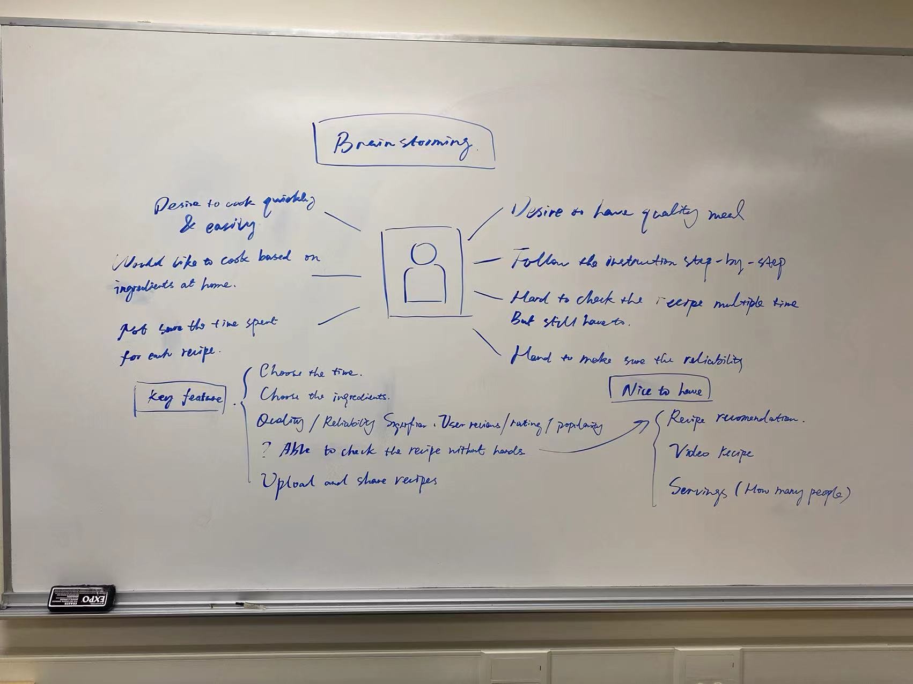
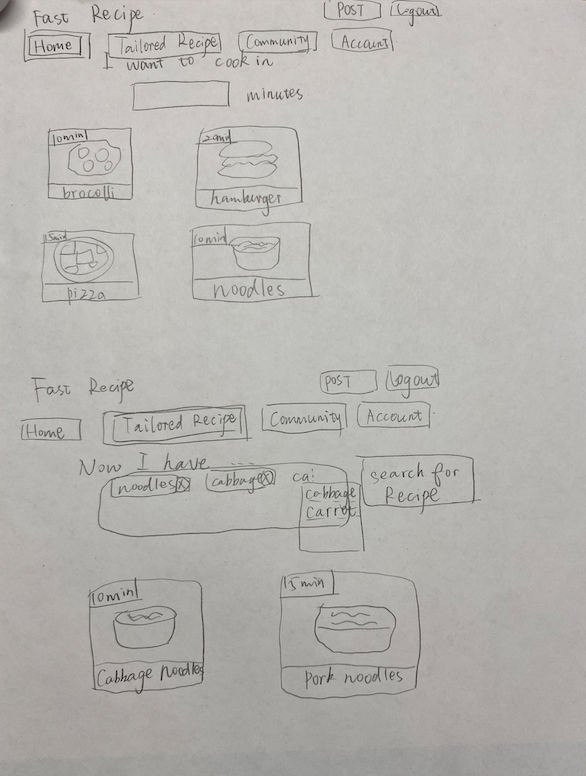
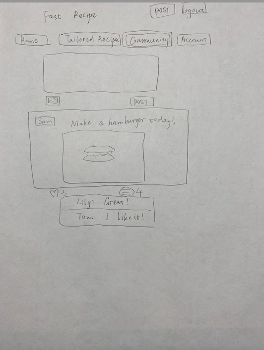
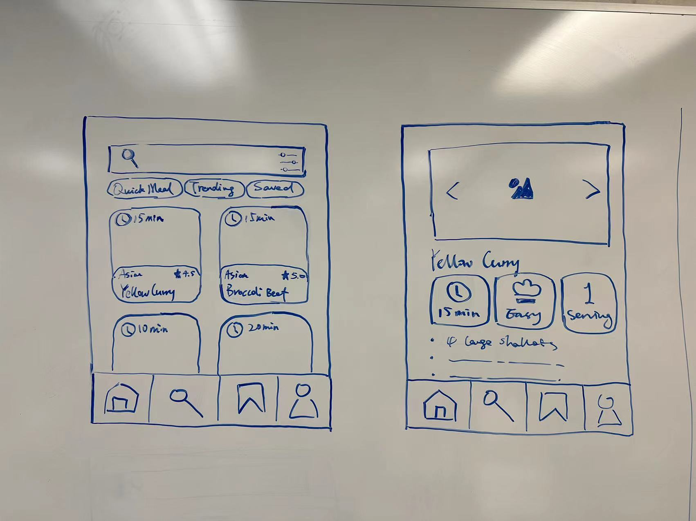
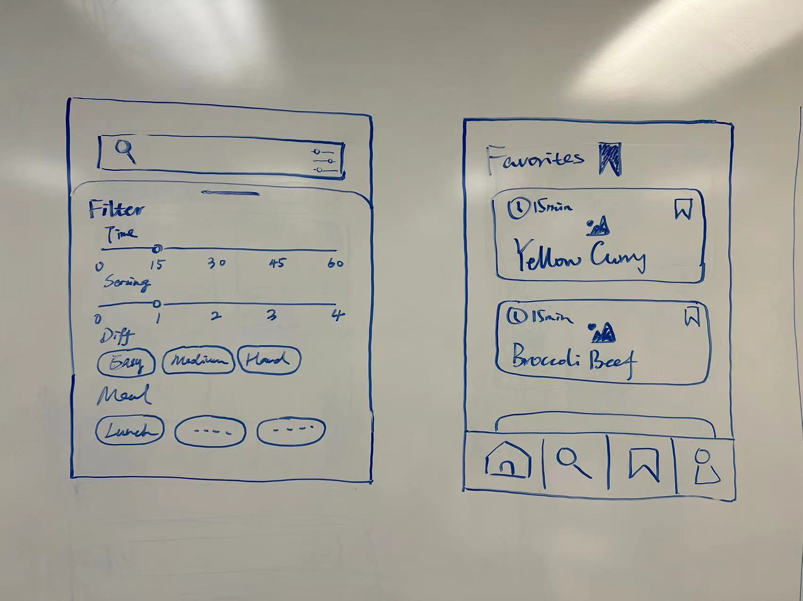
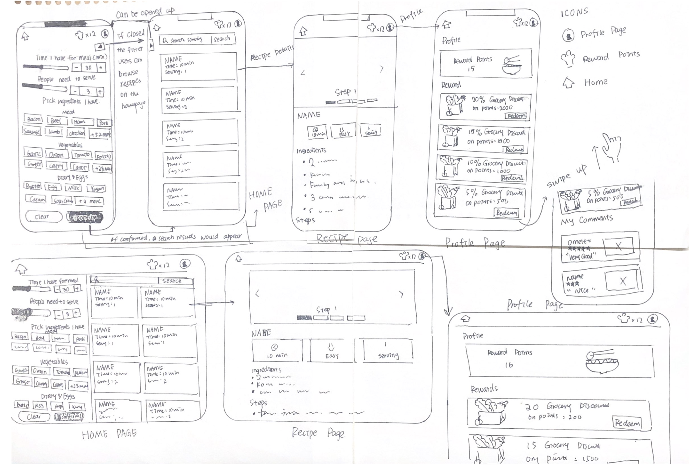

## Brainstorming and Sketches

Our team brainstormed using a whiteboard during the studio to list out the initial version of app features that we would like to include in our app.

These are the sketches of the UI that each team member proposed based on user research. For example, a user who would like to make a meal in a short period of time can use a slider to select the approximate time of the meal. Each recipe card can display the recipe name and average time taken to cook, so users can have a good idea of how much time is allocated to prepare this meal.

Users can leave comments on each recipe and this provides incentive for other users to upload high quality recipes.

Placing a search bar on the top can help users quickly locate the recipe given some keywords.

User can select what ingredients it owns, the result will filter out some suggested recipe tailor for these available ingredients.

## Final Sketch

This is the final sketch after going through the design process.

